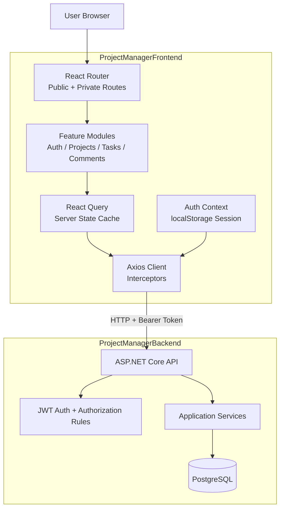

# Project Manager Frontend

## Project Overview

This is the frontend client for the Project Manager ecosystem.

It is a portfolio and learning project built to practice modern React architecture against a real backend API, not a production-grade enterprise product.

The backend companion repository is `ProjectManagerBackend` (.NET 8 + Clean Architecture), and this frontend is where UI, UX, state management, and API integration are implemented feature by feature.

## Purpose

The goal is to move beyond basic static CRUD screens and practice:

- Feature-based frontend architecture.
- Authentication flows with protected routes.
- Server state and caching patterns.
- Typed forms and validation.
- Real integration with an external backend that has authorization rules.

## Tech Stack

- Framework: React 19
- Language: TypeScript
- Build Tool: Vite
- Routing: React Router
- Server State: TanStack Query (React Query)
- HTTP Client: Axios
- Forms: React Hook Form
- Validation: Zod
- Styling: Tailwind CSS
- Testing: Vitest
- Code Quality: ESLint + Prettier

## Frontend-Backend Relationship

This frontend consumes the backend API exposed by `ProjectManagerBackend`.

Current environment setup points to:

- `VITE_API_URL=http://localhost:5081/api`

Integration flow:

1. User logs in or registers from the frontend.
2. Backend returns auth payload with token and expiration.
3. Frontend stores auth response in localStorage.
4. Axios request interceptor injects `Authorization` header automatically.
5. Feature modules call backend endpoints by domain (auth, projects, later tasks/comments).

Error handling integration:

- Backend returns problem details payloads.
- Frontend response interceptor maps those errors into readable UI-safe messages.

## Core Features

### Authentication (Implemented)

- Login and register screens.
- Auth context and session persistence.
- Token expiration check on app startup.
- Protected routes via `PrivateRoute`.

Related backend domain:

- `POST /api/auth/register`
- `POST /api/auth/login`

### Projects (Implemented)

- List projects.
- Create project.
- Update project.
- Delete project.
- Project detail page.

Related backend domain:

- `GET /api/projects`
- `POST /api/projects`
- `PUT /api/projects/{id}`
- `DELETE /api/projects/{id}`

### Tasks (Scaffolded, Not Connected Yet)

- Feature folder structure exists.
- API/composition placeholders are present.
- Full UI + integration is planned next.

Related backend readiness:

- Backend already exposes task endpoints, ready for frontend integration.

### Comments (Scaffolded, Not Connected Yet)

- Feature folder structure exists.
- API/composition placeholders are present.
- Full UI + integration is planned after tasks.

Related backend readiness:

- Backend already exposes task comments endpoints with authorization rules.

## Quickstart

### Prerequisites

- Node.js 20+
- npm
- Backend API running locally (`ProjectManagerBackend`)

### Setup

1. Install dependencies:

```bash
npm install
```

2. Configure environment variables in `.env`:

```env
VITE_API_URL=http://localhost:5081/api
VITE_APP_NAME=Project Manager
VITE_ENABLE_DEBUG=true
```

3. Start development server:

```bash
npm run dev
```

### Scripts

- `npm run dev` - start local development server
- `npm run build` - type-check and build production bundle
- `npm run preview` - preview production build locally
- `npm run test` - run tests with Vitest
- `npm run lint` - run ESLint
- `npm run lint:fix` - auto-fix lint issues
- `npm run typecheck` - run TypeScript checks
- `npm run format` - format files with Prettier
- `npm run format:check` - validate formatting

## API Coverage Matrix

| Domain | Backend Status | Frontend Status |
|---|---|---|
| Auth | Implemented | Implemented |
| Projects | Implemented | Implemented |
| Tasks | Implemented | Planned (scaffolded) |
| Task Comments | Implemented | Planned (scaffolded) |

## Project Structure

```text
src/
	app/                 # app router, providers, and route guards
	features/
		auth/              # auth API, forms, context, hooks, pages, schema, types
		projects/          # project API, UI, hooks, pages, schema, types
		tasks/             # scaffolded feature for upcoming implementation
		comments/          # scaffolded feature for upcoming implementation
	layouts/             # app and auth layouts
	shared/              # reusable API client, config, UI kit, utils, common types
	styles/              # global styling layer
	tests/               # vitest test files
```

## System Diagram (Current)



## Current Development Notes

- This project intentionally prioritizes learning and architecture practice.
- Backend capabilities are ahead of frontend in tasks/comments, by design.
- The frontend roadmap follows backend domains to keep both repositories aligned.

## Roadmap

- Implement full Tasks feature (list/detail/create/update/delete and UX states).
- Implement full Task Comments feature (list/create/update/delete).
- Improve loading, error, and empty-state UX consistency.
- Increase test coverage by feature (components, hooks, integration behavior).
- Prepare deployment-ready frontend environment configuration.

## Key Learnings Targeted

- Building a scalable React app by domain-driven feature folders.
- Integrating JWT auth from a separate backend repository.
- Handling real API errors and async UI state transitions.
- Growing a project iteratively while keeping architecture clean.

## Project Status

Active development, portfolio-learning focus.

## License

Personal project for learning and portfolio showcase.
