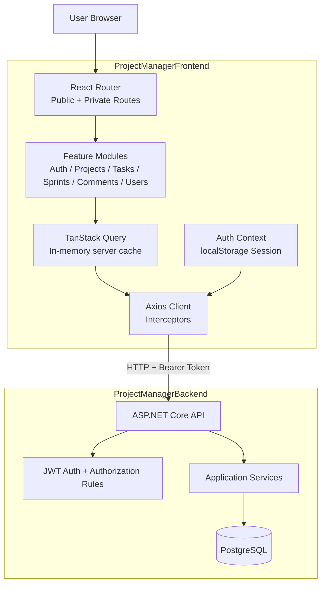

# Project Manager Frontend

A React 19 + TypeScript client for a project management platform inspired by Jira and Azure DevOps, supporting Agile and Scrum methodologies. Created to explore modern frontend architecture and integrate with a real .NET 8 API.

This is a **portfolio and learning project**, not a commercial product. The goal is to grow one feature at a time — authentication, server state, typed forms, domain APIs, and on-device AI — while keeping the codebase clean enough to read in a single sitting.

Url: https://project-manager-frontend-virid.vercel.app/

## Features

- **Authentication** — login, register, session persistence, protected routes, and an optional demo account.
- **Projects** — dashboard with list, create, edit, delete, and detail views.
- **Tasks** — global and project-scoped views, filtering by member and sprint, task detail with comments.
- **Sprints** — Kanban board per sprint (Planned, Active, Completed, Canceled) with drag-and-drop task assignment using `@dnd-kit/core`.
- **Task Comments** — list, create, edit, and delete comments scoped to each task.
- **AI Task Automation** — turn meeting transcripts (Teams / Google Meet, `.txt` / `.md`) into reviewable task drafts using a local WebLLM model, with a self-correcting retry pass, a deterministic fallback parser, and a fixed 60s timeout.
- **User Profile** — personal stats endpoint, avatar menu, and an in-app upgrade flow (Pro plan) with confetti feedback.
- **Application Shell** — responsive navbar, sidebar, theme switcher (light/dark persisted to `localStorage`).

## Tech Stack

| Layer            | Technology                                                          |
| ---------------- | ------------------------------------------------------------------- |
| Framework        | React 19 + TypeScript (strict)                                      |
| Build tool       | Vite                                                                |
| Routing          | React Router v7                                                     |
| Server state     | TanStack Query v5                                                   |
| HTTP client      | Axios (centralized interceptors)                                    |
| Forms & schema   | React Hook Form + Zod (`@hookform/resolvers`)                       |
| Styling          | Tailwind CSS v4 + DaisyUI                                           |
| Drag and drop    | `@dnd-kit/core`                                                     |
| On-device LLM    | `@mlc-ai/web-llm` (default: `Phi-3.5-mini-instruct-q4f16_1-MLC` via WebGPU) |
| Icons / FX       | `lucide-react`, `canvas-confetti`                                   |
| Testing          | Vitest                                                              |
| Quality          | ESLint + Prettier + `tsc -b`                                        |

## Architecture

The codebase is organized by **functional domain**, not by file type. Each feature owns its API, hooks, types, schemas, components, and pages so it can grow without polluting shared modules.

```text
src/
  app/                 # router, providers, guards
  features/
    auth/              # login, register, context, session persistence
    projects/          # dashboard, detail, members, forms, permissions
    tasks/             # list, detail, mutations, AI pipeline
    sprints/           # Kanban board, sprint CRUD, task assignment
    comments/          # list and composer for task comments
    users/             # user stats, Pro plan sidebar, upgrade modal
  layouts/             # auth shell and main application shell
  shared/              # HTTP client, reusable UI, config, env validation
  styles/              # global styles
  tests/               # Vitest tests
```

### Navigation Flow

- Public routes render the auth shell (`/login`, `/register`).
- Protected routes are wrapped by `PrivateRoute` and render the main application shell (navbar + sidebar + content).
- The sidebar exposes domain entries (Projects, Sprints) and contextual actions per project.

## Quick Start

### Requirements

- Node.js 20+
- npm
- The companion `ProjectManagerBackend` running locally (or a deployed URL)

### Install and run

```bash
npm install
cp .env .env.local   # adjust values if needed
npm run dev
```

### Environment variables

Validated at boot by Zod in `src/shared/config/env.ts`. The app fails fast if `VITE_API_URL` is missing or invalid.

```env
VITE_API_URL=http://localhost:5081/api
VITE_APP_NAME=Project Manager
VITE_DEMO_EMAIL=demo@example.com
VITE_DEMO_PASSWORD=demo-password
VITE_ENABLE_DEBUG=true
```

For a deployed build, point `VITE_API_URL` at the live backend, e.g.:

```env
VITE_API_URL=https://projectmanagerbackend-f8df.onrender.com/api
```

The "Login as Demo" button only appears when both `VITE_DEMO_EMAIL` and `VITE_DEMO_PASSWORD` are set and the backend account exists.

## How It Works

### Centralized HTTP client

All backend traffic goes through a single Axios instance in `src/shared/api/httpClient.ts` that:

1. Reads its `baseURL` from `VITE_API_URL`.
2. Sends `Content-Type: application/json` by default.
3. Attaches `Authorization: Bearer <token>` from the auth context.
4. Normalizes Problem Details-style error payloads into a single UI-friendly shape.

Features never make ad-hoc requests — they call their domain API, which uses the shared client.

### Auth and session

- The session is stored in `localStorage` under `authResponse` (`accessToken`, `tokenType`, `expiresAtUtc`, `user`).
- On startup, `AuthProvider` reads the value, checks the token's `expiresAtUtc`, and clears it if expired.
- `PrivateRoute` redirects unauthenticated users to `/login` while preserving the intended destination.

### Server state with TanStack Query

- Defaults: `staleTime` 5 minutes, 1 retry, selective invalidation after project / task / sprint / comment mutations.
- The cache is **in-memory only** in this branch — it is rebuilt on page reload.

### Sprints and Kanban

- Sprint states: `Planned`, `Active`, `Completed`, `Canceled`.
- The Sprints section renders a Kanban board per sprint with four columns: `Todo`, `In Progress`, `Done`, `Canceled`.
- Drag and drop is implemented with `@dnd-kit/core`; dropping a task on a column updates its state and reassigns it to the sprint in a single round-trip through the API.

### AI Task Automation

Restricted to project admins and coordinators, exposed from the project detail page. The user pastes a meeting transcript or uploads a `.txt` / `.md` file, and the pipeline returns a list of **reviewable task drafts** — the user is always in the loop, nothing is created in the backend until they confirm.

The interesting design choice is splitting the work into **three explicit stages** so a small, quantized, in-browser LLM only does what it is actually good at (lifting tagged fragments out of prose), and every structural decision stays in deterministic TypeScript that can be unit tested, audited, and changed without retraining anything.

```text
Transcript (.txt / .md)
   |
   v
Stage 0: Preprocessor (TypeScript)
   |  - detect language (es / en) via stopword scoring
   |  - detect meeting date from the header line
   |  - tag dates inline (Spanish natural dates -> ISO YYYY-MM-DD)
   |  - tag members by name in the text
   |  - mark task boundaries (">>> TASK START >>>")
   v
Stage 1: LLM Extraction (WebLLM, WebGPU)
   |  - prompt: "extract tagged items, do not group them"
   |  - on parse failure: 1 retry with a correction prompt at lower temperature
   |  - on any failure (timeout, GPU OOM, bad JSON):
   |        -> transparent switch to Stage 1b fallback parser
   v
Stage 1b: Deterministic Fallback Parser
   |  - structured mode (Tarea: **<title>** + bullets)
   |  - natural mode (imperative verbs, ordinal markers, date lines)
   |  - emits the SAME LlmItemExtraction shape as the LLM
   v
Stage 2: Consolidator (TypeScript)
   |  - cleanup transcript artifacts
   |  - dedupe by (kind, normalized text)
   |  - split by block_start markers or group by assigneeHint
   |  - assemble description (Requisitos, Detalles técnicos, Hitos, Asignaciones)
   |  - resolve assignee against project members (email -> name -> owner)
   |  - normalize priority (Low / Medium / High / Critical, default Medium)
   v
TaskDraftForCreation[] -> review modal -> user confirms -> backend
```

**Models.** The user picks one of four WebLLM models from an in-app selector. All run locally through WebGPU; no transcript ever leaves the browser.

| Tier   | Model                                  | Approx. size |
| ------ | -------------------------------------- | ------------ |
| small  | `Qwen2.5-1.5B-Instruct-q4f16_1-MLC`    | ~1.0 GB      |
| small  | `Llama-3.2-1B-Instruct-q4f16_1-MLC`    | ~0.8 GB      |
| small  | `gemma-2-2b-it-q4f16_1-MLC`            | ~1.6 GB      |
| medium | `Phi-3.5-mini-instruct-q4f16_1-MLC` (default) | ~2.3 GB      |

**Safeguards baked into the pipeline.**

- **Timeout**: a 60s hard cap on the LLM call (`EXTRACTION_TIMEOUT_MS`). If the model is slow or hung, the pipeline moves to the fallback parser.
- **GPU OOM**: caught separately and surfaced as a helpful message suggesting the user switch to a smaller model from the selector (Qwen 1.5B or Llama 1B).
- **Self-correction pass**: if the LLM returns invalid JSON, a second prompt at a lower temperature (`0.05` vs `0.1`) feeds the error back to the model and asks it to return corrected JSON. Only after that fails does the fallback parser take over.
- **Force fallback**: the input accepts a `forceFallback` flag to skip the LLM entirely (useful for testing, debugging, and users without a GPU).
- **Deterministic contract**: both Stage 1 and Stage 1b produce the same `LlmItemExtraction` shape, so the consolidator never has to know which path produced the items. The downstream code is identical.

**Stage 0 — Preprocessor.** Runs before the model is even loaded. It detects the transcript language (es / en), finds the meeting date in the header, converts Spanish natural dates (`20 de junio de 2026`) into ISO `YYYY-MM-DD` inline, tags member names so the model can match them to project members, and inserts `>>> TASK START >>>` markers at task boundaries. The preprocessed text is what actually gets sent to the LLM, which is why the model rarely has to do date math or name resolution on its own.

**Stage 1 — LLM extraction.** The model is prompted to output **tagged fragments**, not finished tasks. It returns a flat list of `LlmItemExtraction` items with a `kind` taxonomy (`requirement`, `spec`, `decision`, `date`, `assignee`, `context`), plus the header attributes (`taskTitle`, `taskAssigneeHint`, `taskDueDate`, `taskPriority`). This is deliberate: a 1B–3B parameter quantized model is much more reliable when it just classifies and lifts pieces of information than when it has to decide on its own how many tasks to create.

**Stage 1b — Fallback parser.** When the LLM is unavailable, a deterministic parser produces the same `LlmItemExtraction` shape, so the rest of the pipeline does not care which path produced the items. It has two scanning modes:
- **Structured mode** — handles transcripts with `**Speaker:** Tarea: **<title>**` markers, bold formatting, and bullet lists.
- **Natural mode** — handles free-form transcripts: detects titles from imperative verbs (`Desarrollar`, `Implementar`, `Migrar`, ...), block boundaries from ordinal markers (`Primera tarea`, `Segunda tarea`, ...), assignees from phrases like `voy a asignar esta tarea a X` or `me encargo`, dates from lines mentioning `fecha límite` / `deadline`, and specs from lines containing `endpoint` / `api` / `cada N minutos`.

**Stage 2 — Consolidator.** Receives the `LlmItemExtraction` and produces `TaskDraftForCreation[]` ready for the review modal:
1. **Cleanup** — strips transcript artifacts (`we need to`, `hay que`, `please`, `action item`, etc.).
2. **Deduplication** — drops items with the same `(kind, normalized text)` pair.
3. **Block splitting** — if `block_start` items are present, the list is sliced at each marker; the header attributes come from the `block_start` item.
4. **Fallback grouping** — if no `block_start` items exist, items are grouped by `assigneeHint`. A side group only becomes its own task if it contains **at least 2 items**; single-mention side groups are merged into the main group, which prevents the model or fallback from creating phantom tasks for incidental name mentions.
5. **Description assembly** — `context` items become the opening sentence, `requirement` / `decision` items become a `Requisitos:` bullet list, `spec` items become a `Detalles técnicos:` bullet list, `date` items become a `Hitos:` bullet list, and `assignee` items become an `Asignaciones:` bullet list.
6. **Truncation** — description is hard-capped at 8000 characters to stay within the backend's description limit.

**Assignment logic.** Resolved in this order:
1. Match `assigneeHint` (or `block_start.assigneeHint`) against project members by **email first**, then by **display name**.
2. If no match is found, assign to the **project owner**.
3. If the transcript does not mention any person, use the same owner fallback.

This keeps the workflow deterministic even when the transcript is ambiguous.

**Dates and priorities.**
- Dates are normalized to `YYYY-MM-DD`. The fallback parser uses a Spanish natural date parser and infers the year from the meeting date in the header.
- Only the **official final deadline** becomes `dueDate`; intermediate dates (`primera versión el 13 de junio`, etc.) go into the `Hitos:` section of the description.
- Priorities are normalized into the existing task enum: `Low`, `Medium`, `High`, `Critical`. If priority is not clear, the consolidator defaults to `Medium`.
- The header date of the meeting itself is **never** used as a milestone.

**Confidence score.** A quality indicator on each draft. LLM-produced drafts get a higher confidence than fallback-produced ones. It does not block creation, but it helps the reviewer understand how certain the extraction was.

**Review and cleanup.**
- The modal keeps draft tasks available while the user performs consecutive extractions, so new transcript results are appended to the current review set.
- When the modal is closed, the transcript, logs, and draft state are cleared.
- The process log can be expanded or collapsed and shows model loading, parsing, fallback, and creation events.

**Debug logs.** Two `console.log` entries are emitted:
- `[AI DEBUG] Raw LLM extraction` — the exact JSON the model returned.
- `[AI DEBUG] Consolidated drafts` — the list of `TaskDraftForCreation` produced by the consolidator.

When the LLM is unavailable and the fallback parser is used, only the second log is printed and the extraction message says `(fallback parser)`. This is the easiest way to tell which path produced the drafts when iterating on the prompt or the parser rules.

### Users and Pro plan

- `usersApi.getMyStats()` hits `GET /users/me/stats` to power the avatar menu and project usage hints.
- The Pro plan sidebar and upgrade modal are demo surfaces — clicking the upgrade CTA fires a confetti animation and confirms the intent in-app without charging anything.

## Scripts

| Command              | What it does                              |
| -------------------- | ----------------------------------------- |
| `npm run dev`        | Start the Vite dev server                 |
| `npm run build`      | Type-check (`tsc -b`) and build           |
| `npm run preview`    | Serve the local production build          |
| `npm run test`       | Run the Vitest suite                      |
| `npm run lint`       | Run ESLint                                |
| `npm run lint:fix`   | Auto-fix lint issues                      |
| `npm run typecheck`  | TypeScript-only check                     |
| `npm run format`     | Format with Prettier                      |
| `npm run format:check` | Verify Prettier formatting             |

## Deployment (Vercel)

The repo ships with a `vercel.json` SPA rewrite so React Router routes resolve on refresh.

- **Framework preset**: Vite
- **Build command**: `npm run build`
- **Output directory**: `dist`
- **Required env var**: `VITE_API_URL` pointing at the deployed backend

## What I Learned

- **Web Frontend big project** This project has been more than just a practice exercise; it has provided an opportunity to apply my frontend knowledge to a real product and continue building and enhancing it over time.
- **Domain-based folder structure** keeps feature growth sustainable without turning `shared/` into a dumping ground.
- **Splitting AI work into three explicit stages** (preprocessor -> LLM extraction with self-correction -> deterministic consolidator) lets a 1B–3B parameter quantized model be genuinely useful inside the browser, while keeping every structural decision in code that can be unit tested. The trick was a shared `LlmItemExtraction` contract that lets the LLM and the fallback parser be swapped transparently.
- **Centralizing HTTP and error mapping** removes a huge amount of boilerplate from feature code.
- **Selective TanStack Query invalidation** is a better default than broad refetches for CRUD apps.
- **Validating environment variables with Zod at boot** is the cheapest way to catch config drift between local and deployed environments.

## Architecture Diagram


```mermaid
flowchart TD
  User[User Browser]

  subgraph FE[ProjectManagerFrontend]
    Router[React Router\nPublic + Private Routes]
    Auth[Auth Context\nlocalStorage Session]
    Query[TanStack Query\nIn-memory server cache]
    Http[Axios Client\nInterceptors]
    Features[Feature Modules\nAuth / Projects / Tasks / Sprints / Comments / Users]

    Router --> Features
    Features --> Query
    Query --> Http
    Auth --> Http
  end

  subgraph BE[ProjectManagerBackend]
    Api[ASP.NET Core API]
    Jwt[JWT Auth + Authorization Rules]
    Services[Application Services]
    Db[(PostgreSQL)]

    Api --> Jwt
    Api --> Services
    Services --> Db
  end

  User --> Router
  Http -->|HTTP + Bearer Token| Api
```

## License

Personal project — built for learning and portfolio purposes.
