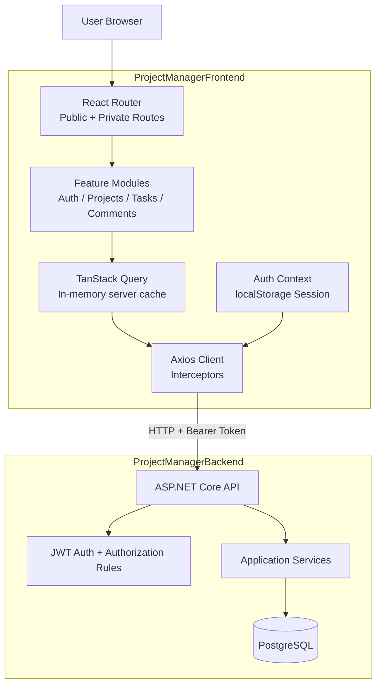

# Project Manager Frontend

Frontend client for the Project Manager ecosystem, built to practice modern React architecture against a real .NET 8 API.

This is not meant to be a closed enterprise application. It is an evolving technical portfolio where authentication, protected routes, server state, typed forms, and domain-based backend integration are implemented feature by feature.

## Current State

This branch leaves the frontend in a functional state for the main product domains:

- Authentication with login, register, session persistence, and protected routes.
- Projects dashboard with list, create, edit, delete, and detail views.
- Task management with project-scoped and global views.
- AI-assisted task automation from meeting transcripts using local WebLLM.
- Comments attached to tasks from the task detail screen.
- Application shell with navigation, sidebar, and theme switcher.

## Tech Stack

- React 19
- TypeScript
- Vite
- React Router
- TanStack Query
- Axios
- React Hook Form
- Zod
- Tailwind CSS + DaisyUI
- Vitest
- ESLint + Prettier

## Architecture

The codebase is organized by functional domains, not by generic file type. The goal is for each feature to grow in isolation without turning the project into a shared-components dumping ground.

```text
src/
  app/                 # router, providers, and guards
  features/
    auth/              # login, register, context, and session persistence
    projects/          # dashboard, detail, hooks, and forms
    tasks/             # global list, detail, and mutations
    comments/          # list and composer for task comments
  layouts/             # auth shell and main application shell
  shared/              # HTTP client, reusable UI, config, and utilities
  styles/              # global styles
  tests/               # Vitest tests
```

### Navigation Flow

- Public routes go to login and register.
- Protected routes are guarded by `PrivateRoute`.
- The main shell groups the navbar, sidebar, footer, and page content.

## Local API Integration

The frontend connects to the local backend API through this environment variable:

```env
VITE_API_URL=http://localhost:5081/api
```

That URL is consumed from `src/shared/config/env.ts`, where the environment is validated with Zod before the app boots. If the variable is missing or not a valid URL, the app fails fast.

### Production API URL

For Vercel, set `VITE_API_URL` to your deployed backend URL, for example:

```env
VITE_API_URL=https://projectmanagerbackend-f8df.onrender.com/api
```

This is the only value the frontend needs in order to talk to your deployed API. The same Axios client will keep attaching the JWT automatically after login.

### Demo Access

The login screen can show an "Login as a Demo" button that reuses the regular auth flow with a preconfigured demo account.

Add these variables to enable it:

```env
VITE_DEMO_EMAIL=demo@example.com
VITE_DEMO_PASSWORD=demo-password
```

The button only works if that account exists in the backend and returns a valid auth response. This keeps demo access identical to a real session, so the user can browse protected routes and perform allowed actions without registering a new account.

### HTTP Client

All backend communication goes through a centralized Axios client in `src/shared/api/httpClient.ts`.

That client applies three important decisions:

1. It uses `baseURL` from `VITE_API_URL`.
2. It sends `Content-Type: application/json` by default.
3. It automatically injects the `Authorization` header when a session is available.

In practice, features do not make one-off requests with random config. They use a uniform client that already knows how to authenticate and how to surface errors consistently.

## Local Persistence and Cache

It is important to distinguish between authenticated session data and server cache data:

### JWT Session in localStorage

The session is stored in `localStorage` under the `authResponse` key.

That object includes:

- `accessToken`
- `tokenType`
- `expiresAtUtc`
- `user`

When the app starts, `AuthProvider` reads that value, checks whether the token is still valid, and clears it if the session has expired. On login, the new auth response is saved again; on logout, it is removed.

This gives us:

- Session persistence after refresh.
- Auth state rehydration without logging in again.
- Automatic JWT attachment on authenticated requests.

### Server Cache with TanStack Query

The server cache is not persisted to `localStorage` in this branch. It lives in memory through TanStack Query with the following defaults:

- `staleTime` of 5 minutes.
- 1 retry for failed queries.
- Selective invalidation after project, task, and comment mutations.

That means the cache improves navigation speed and reduces redundant requests during the current session, but it is rebuilt on page reload. If persistent query cache is needed later, an explicit persistence layer for React Query should be added.

### Other Local Keys

- The visual theme is also stored in `localStorage` under `theme`.

## Technical Decisions

### 1. Auth context plus localStorage

Authentication lives in a dedicated `AuthProvider` because session state is shared across the app and must survive refreshes. This avoids prop drilling and centralizes login, logout, expiration, and rehydration.

### 2. React Query for server state

Projects, tasks, and comments are remote state, not local state. TanStack Query is used to manage them, with precise invalidation after create, update, and delete operations.

### 3. Domain-based APIs

Each feature owns its own API layer, hooks, types, and forms. That lowers coupling and makes the backend easier to follow by business area.

### 4. Form validation with Zod

Validation is not left to the backend alone. Forms are typed and validated before submit to improve UX and reduce invalid requests.

### 5. Consistent error handling

The API returns Problem Details-style payloads, and the HTTP interceptor converts them into UI-friendly messages. That avoids repeating error parsing across screens.

## Features

### Authentication

- Login and register.
- Session persistence on refresh.
- Token expiration checked on startup.
- Protected private routes.

Related endpoints:

- `POST /api/auth/login`
- `POST /api/auth/register`

### Projects

- Project listing.
- Create and edit from a modal.
- Delete projects.
- Project detail view.

Related endpoints:

- `GET /api/projects`
- `POST /api/projects`
- `PUT /api/projects/{id}`
- `DELETE /api/projects/{id}`

### Tasks

- Global tasks view.
- Project-scoped tasks view.
- Detail view with project context.
- Task creation from the page itself.

### AI Task Automation

The project detail screen now exposes an AI automation entry point next to the Calendar and Overview controls. The feature is restricted to project admins and coordinators.

It is designed to turn Microsoft Teams or Google Meet transcripts into reviewable task drafts before they are persisted.

#### User flow

1. Open a project detail page.
2. Launch the AI automation modal.
3. Paste a transcript or upload a `.txt` / `.md` file.
4. Extract one or more task drafts from the transcript.
5. Review and edit the generated drafts.
6. Create the tasks in batch.

#### Model used

The first version uses a local browser model through WebLLM:

- `Llama-3.2-3B-Instruct-q4f32_1-MLC`

The model runs locally in the browser when WebGPU is available. If initialization fails or takes too long, the feature falls back to a local transcript parser so the workflow remains usable and never blocks task creation.

#### Prompt and output contract

The extraction prompt instructs the model to return JSON only, with the following shape:

```json
{
  "tasks": [
    {
      "title": "string",
      "description": "string",
      "priority": "Low | Medium | High | Critical",
      "dueDate": "YYYY-MM-DD or ISO date",
      "assigneeHint": "name or email",
      "confidence": 0.0
    }
  ]
}
```

Prompt rules:

- Extract multiple tasks when the transcript contains more than one action item.
- Rewrite the transcript into task language. Do not copy phrases literally.
- Keep titles concise, specific, and action-oriented.
- Keep descriptions as clean summaries of the action to be done.
- Use `assigneeHint` only when a person is explicitly mentioned.
- Keep `confidence` between `0` and `1`.
- Return valid JSON only, with no markdown or extra commentary.

#### Assignment logic

Task assignment is resolved in this order:

1. If the model returns an assignee hint, the app tries to match it against project members by email or display name.
2. If no match is found, the task is assigned to the project owner.
3. If the transcript does not mention a person, the same owner fallback is used.

This keeps the workflow deterministic even when the transcript is ambiguous.

#### Dates and priorities

- When the model detects a date, the app normalizes it to `YYYY-MM-DD` before creating the task.
- If a date cannot be parsed, the task remains without a completion date.
- Priorities are normalized into the existing task enum: `Low`, `Medium`, `High`, `Critical`.
- If priority is not clear, the app defaults to `Medium`.

#### Confidence score

`confidence` is a quality indicator for the extracted draft. It does not block creation by itself, but it helps the reviewer understand how certain the extraction was.

#### Review and cleanup behavior

- The modal keeps draft tasks available while the user performs consecutive extractions, so new transcript results are appended to the current review set.
- When the modal is closed, the transcript, logs, and draft state are cleared.
- The process log can be expanded or collapsed and shows model loading, parsing, fallback, and creation events.

### Task Comments

- Comment listing by task.
- Create comment.
- Edit own comment.
- Delete own comment.

## Backend Connection

The frontend consumes the local `ProjectManagerBackend` companion service. The flow is:

1. The user logs in or registers.
2. The backend returns an authentication payload with token, token type, expiration, and user data.
3. The frontend stores that response in `localStorage`.
4. The Axios interceptor adds `Authorization: Bearer <token>` to authenticated requests.
5. Features call their domain API and TanStack Query handles cache and synchronization.

## Quick Start

### Requirements

- Node.js 20 or newer
- npm
- `ProjectManagerBackend` running locally

### Install

```bash
npm install
```

### Environment Variables

Create a `.env` file with the following content:

```env
VITE_API_URL=http://localhost:5081/api
VITE_APP_NAME=Project Manager
VITE_DEMO_EMAIL=demo@example.com
VITE_DEMO_PASSWORD=demo-password
VITE_ENABLE_DEBUG=true
```

### Run

```bash
npm run dev
```

## Deploying to Vercel

This project is ready to be deployed as a Vite SPA on Vercel.

### Build settings

- Framework preset: `Vite`
- Build command: `npm run build`
- Output directory: `dist`
- Root directory: leave empty unless the app lives inside a subfolder

### Environment variables

Add these in the Vercel project settings:

```env
VITE_API_URL=https://projectmanagerbackend-f8df.onrender.com/api
VITE_APP_NAME=Project Manager
VITE_DEMO_EMAIL=demo@example.com
VITE_DEMO_PASSWORD=demo-password
VITE_ENABLE_DEBUG=false
```

### SPA routing

The repository includes `vercel.json` with a rewrite so React Router routes like `/login`, `/projects`, or `/projects/:id` resolve correctly on refresh.

### Deployment flow

1. Import the repository into Vercel.
2. Keep the root directory at the repository root.
3. Set the environment variables above.
4. Deploy.
5. Verify login, protected routes, and API calls against the Render backend.

## Scripts

- `npm run dev` - starts the development server.
- `npm run build` - type-checks and builds the production bundle.
- `npm run preview` - serves the local production build.
- `npm run test` - runs the Vitest suite.
- `npm run lint` - runs ESLint.
- `npm run lint:fix` - automatically fixes lint issues.
- `npm run typecheck` - runs TypeScript checks.
- `npm run format` - formats files with Prettier.
- `npm run format:check` - verifies formatting.

## Status Matrix

| Domain        | Backend     | Frontend    |
| ------------- | ----------- | ----------- |
| Auth          | Implemented | Implemented |
| Projects      | Implemented | Implemented |
| Tasks         | Implemented | Implemented |
| AI automation | N/A         | Implemented |
| Task comments | Implemented | Implemented |

## Diagram


```mermaid
flowchart TD
  User[User Browser]

  subgraph FE[ProjectManagerFrontend]
    Router[React Router\nPublic + Private Routes]
    Auth[Auth Context\nlocalStorage Session]
    Query[TanStack Query\nIn-memory server cache]
    Http[Axios Client\nInterceptors]
    Features[Feature Modules\nAuth / Projects / Tasks / Comments]

    Router --> Features
    Features --> Query
    Query --> Http
    Auth --> Http
  end

  subgraph BE[ProjectManagerBackend]
    Api[ASP.NET Core API]
    Jwt[JWT Auth + Authorization Rules]
    Services[Application Services]
    Db[(PostgreSQL)]

    Api --> Jwt
    Api --> Services
    Services --> Db
  end

  User --> Router
  Http -->|HTTP + Bearer Token| Api
```

## Development Notes

- The project is intentionally optimized for learning and incremental growth.
- React Query cache is not persisted to localStorage in this branch.
- JWT session data is persisted and validated on app startup.
- Data synchronization relies on selective invalidation after mutations.
- In production, the frontend should point `VITE_API_URL` to the Render backend, not to localhost.

## Natural Next Steps

- Persist the React Query cache if offline behavior or reload restoration is needed.
- Polish loading, empty, and error states.
- Expand feature-level and integration test coverage.

## Spanish Summary

Este README esta en ingles como idioma principal y deja un resumen breve en espanol para referencia rapida.

- La sesion JWT se guarda en `localStorage` como `authResponse`.
- El cache de datos de TanStack Query vive en memoria y no se persiste en esta rama.
- La API local se configura con `VITE_API_URL=http://localhost:5081/api`.
- La app ya cubre autenticacion, proyectos, tareas y comentarios.

## License

Personal project for learning and portfolio purposes.
